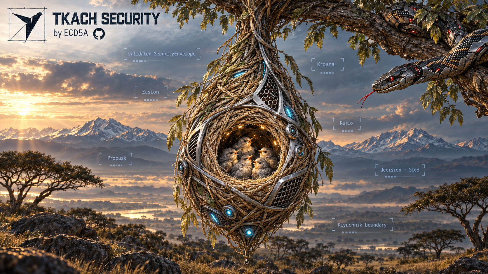
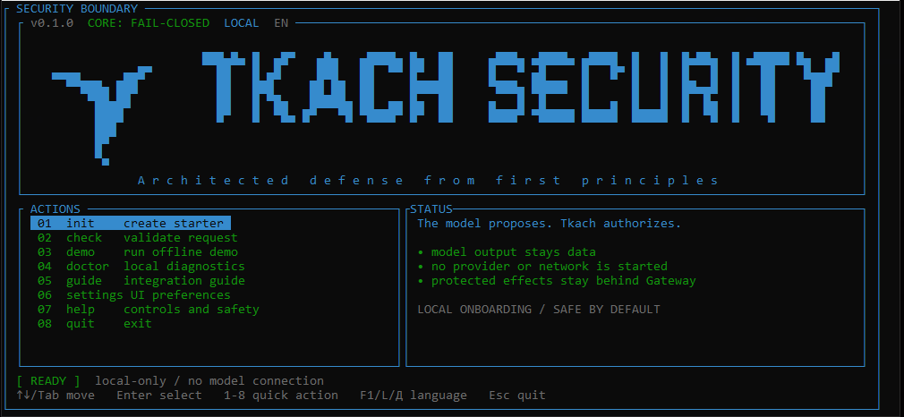

<p align="right">
  <a href="README.ru.md">Русская версия</a>
</p>

<p align="center">
  
</p>

<div align="center">

**A fail-closed security boundary for AI agents and compromised model output.**

<a href="https://github.com/ECD5A/Tkach-Security/actions/workflows/ci.yml"></a>
<a href="https://github.com/ECD5A/Tkach-Security/releases/tag/v0.1.2"></a>
<a href="https://www.npmjs.com/package/tkach-security-client"></a>
<a href="https://pypi.org/project/tkach-security-client/"></a>
<a href="https://crates.io/crates/tkach-cli"></a>


</div>

> The model proposes. Tkach authorizes.

Put Tkach between model proposals and protected actions. Its Rust Core checks
authority and information flow before allowing an action or releasing output.
Model output remains untrusted data, even when the model is compromised.

## Why Tkach

- **Explicit authority:** protected actions need an exact-scope, Core-issued
  `Propusk`; model text cannot create one.
- **Controlled data flow:** permission to read is not permission to export.
  Provenance and release checks remain inside the boundary.
- **Fail-closed decisions:** invalid, denied, replayed, cancelled, or uncertain
  states do not silently become permission.
- **Isolated secrets and bounded evidence:** broker-held secrets stay outside
  ordinary model context; `Sled` receipts do not include payloads.

These guarantees apply to paths routed through Tkach. It does not make the
model trustworthy, detect every prompt injection, or protect a compromised host.

## Start in minutes

Install from crates.io with Rust 1.85 or newer:

```console
cargo install tkach-cli --version 0.1.2 --locked
tkach init my-agent
tkach check my-agent/.tkach/request.json
tkach run --demo
```

`init` creates a starter request without overwriting files; `check` validates
its schema, not permission to execute; `run --demo` exercises the offline
boundary without a model connection. Use `tkach ui` for the interactive panel.

Prefer no Rust toolchain? Download a binary below and start with `tkach init`.

## Packages and downloads · v0.1.2

| Channel | What you get | Install / next step |
| --- | --- | --- |
| [GitHub Releases](https://github.com/ECD5A/Tkach-Security/releases/tag/v0.1.2) | `tkach` + `tkach-mcp`; Linux x86_64, macOS x86_64/arm64, Windows x86_64 | [Verify downloads](docs/DISTRIBUTION.md#verify-a-v012-archive) |
| [crates.io](https://crates.io/crates/tkach-cli) | Seven Rust crates at `0.1.2`: Core, Gateway, HTTP, client, MCP, CLI, provider adapter | [Package list](docs/DISTRIBUTION.md#version-and-package-contract) |
| [npm](https://www.npmjs.com/package/tkach-security-client) | Thin JavaScript / TypeScript HTTP client | `npm install tkach-security-client@0.1.2` |
| [PyPI](https://pypi.org/project/tkach-security-client/) | Thin Python HTTP client | `python -m pip install tkach-security-client==0.1.2` |
| [Official MCP Registry](https://registry.modelcontextprotocol.io/v0.1/servers?search=io.github.ECD5A%2Ftkach-security) | `io.github.ECD5A/tkach-security@0.1.2`, local stdio | [Configure MCP](docs/INTEGRATION.md#mcp-stdio-adapter--v01) |
| [GHCR](https://github.com/ECD5A/Tkach-Security/pkgs/container/tkach-security) | OCI image for Linux amd64 / arm64 | [Digest and deployment](docs/DISTRIBUTION.md#oci-image) |

Binary archives include SHA-256 manifests, keyless Sigstore bundles, and GitHub
build attestations. Pin the OCI digest for deployment; verification details
live in the [distribution guide](docs/DISTRIBUTION.md).

## Integrate without moving policy out of Rust

Use the [HTTP contract](docs/INTEGRATION.md#http-adapter-contract--v01) from
your application, the [Rust client](docs/INTEGRATION.md#rust-client-adapter--v01),
a [Python/JS/TS/Go client](docs/INTEGRATION.md#language-sdks--v01),
or the stdio adapter from an MCP client.
Clients and MCP require a separately started local `tkach serve` runtime and
its bearer token; installing a package does not enable background protection.

`tkach-core` stays provider-, protocol-, and language-independent. Adapters
transport requests; policy and authority stay in Rust. Follow the
[integration guide](docs/INTEGRATION.md) or copy a working [`examples/`](examples/)
scenario. The Go client is a source module, not a separate registry package.

The supported runtime is loopback-only by default. Public internet serving,
TLS termination, Streamable HTTP, a cloud control plane, and a generic executor
are **not included**; see the [deployment contract](docs/PRODUCT_CONTRACT.md).

<details>
<summary>Show the cross-platform CLI window</summary>

<p align="center">
  
</p>
</details>

## See the boundary in action

From a repository checkout, run the offline Golden Case. It needs no model
service or credentials. It performs one create-only write inside a temporary
sandbox, then proves that a sibling path and a compromised provider proposal
are denied:

```console
cargo run -p tkach-gateway --example golden_case --locked
```

Expected result:

```text
GOLDEN_CASE|safe_output=released|allowed_write=committed|out_of_scope=denied|compromised_action=denied|compromised_executor_calls=0
```

The positive path uses trusted host configuration for the exact policy,
destination, and executor binding; the provider supplies only an untrusted
proposal. Read the [architecture](docs/ARCHITECTURE.md) for the enforcement
path and the [release notes](docs/releases/v0.1.2.md) for the release checks and
remaining limitations.

## Documentation

- **Use:** [integration guide](docs/INTEGRATION.md), [examples](examples/), [distribution](docs/DISTRIBUTION.md).
- **Review:** [product contract](docs/PRODUCT_CONTRACT.md), [architecture](docs/ARCHITECTURE.md), [security model](docs/SECURITY_MODEL.md), [threat model](docs/THREAT_MODEL.md).
- **Follow:** [changelog](CHANGELOG.md), [roadmap](docs/ROADMAP.md). Report vulnerabilities through [SECURITY.md](SECURITY.md).

## Contributing

Keep changes small and explicit about the security boundary. Core changes need
a demonstrated security or product defect; adapters must remain thin and must
not duplicate Core logic. See [CONTRIBUTING.md](CONTRIBUTING.md) for required
checks, public-claim rules, and files that must remain local.

## Support

If Tkach Security is useful to your work, support its continued maintenance:

- TON: `pointoncurve.ton`
- Bitcoin (BTC): `1ECDSA1b4d5TcZHtqNpcxmY8pBH1GgHntN`
- USDT (TRC20): `TUF4vPdB6QkjCvZq18rBL4Qj4dK5ihCN75`

## Contact

For inquiries about Tkach Security, integrations, security research, or collaboration:

<p>
  <a href="mailto:stelmak159@gmail.com" aria-label="Email"></a>
  &nbsp;
  <a href="https://t.me/ECDS4" aria-label="Telegram"></a>
  &nbsp;
  <a href="https://github.com/ECD5A/Tkach-Security" aria-label="GitHub repository"><picture><source media="(prefers-color-scheme: dark)" srcset="https://cdn.simpleicons.org/github/FFFFFF"></picture></a>
</p>
