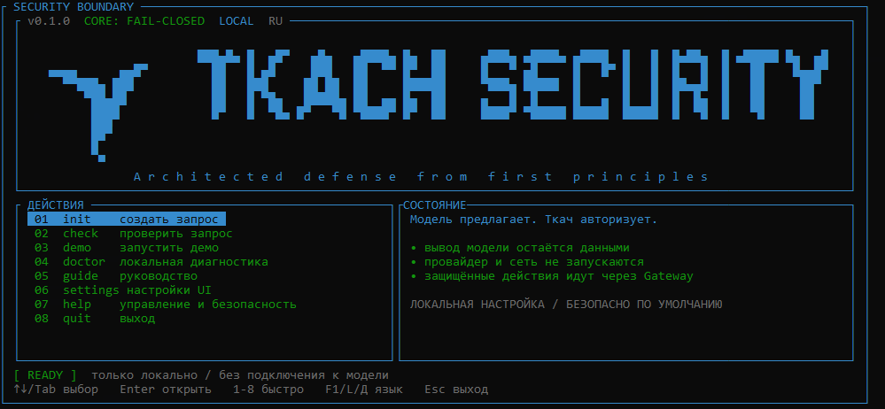

<p align="right">
  <a href="README.md">English version</a>
</p>

<p align="center">
  
</p>

<div align="center">

**Fail-closed граница безопасности для AI-агентов и скомпрометированного вывода модели.**

<a href="https://github.com/ECD5A/Tkach-Security/actions/workflows/ci.yml"></a>
<a href="https://github.com/ECD5A/Tkach-Security/releases/tag/v0.1.0"></a>
<a href="https://www.npmjs.com/package/tkach-security-client"></a>
<a href="https://crates.io/crates/tkach-cli"></a>


</div>

Tkach Security — детерминированная типизированная граница вокруг систем,
которые используют вероятностные или скомпрометированные модели.

> Модель предлагает. Ткач авторизует.

Вывод модели остаётся недоверенными ДАННЫМИ. Tkach не позволяет ему создавать
полномочия, пересекать защищённые границы потоков информации или превращать
брокерские секреты в обычный контекст. Он не пытается сделать модель надёжной.

## Зачем нужен Tkach

- Текст модели и её предложения инструментов не могут создать право на действие.
- Защищённый эффект требует точного, выданного ядром `Propusk`.
- `READ`, `EXPORT` и другие направления — отдельные решения `Ruslo`.
- `Gnezdo`, `Niti` и `Metka` сохраняют консервативное состояние данных и происхождения.
- `Zaslon` и финальные release-gates fail-closed при некорректных, слишком
  больших, запрещённых, повторных, отменённых и неопределённых состояниях.
- `Klyuchnik` удерживает секреты брокера вне обычного контекста модели; `Sled`
  оставляет ограниченное доказательство без payload.

Это защищает путь принуждения, когда модель враждебна. Интегратор, который
обходит Tkach, остаётся за пределами этой границы.

## Golden Case

Офлайн-доказательство не требует модели, сети или реального эффекта:

```console
cargo run -p tkach-gateway --example golden_case --locked
GOLDEN_CASE|safe_output=released|compromised_action=denied|executor_calls=0
```

Полезный ограниченный ответ выпускается. Предложение защищённой записи от
скомпрометированного провайдера отклоняется до вызова executor. Это
детерминированное доказательство границы, а не обещание универсального
распознавания prompt injection или защиты скомпрометированного хоста.

## Старт за несколько минут

Установите из crates.io с Rust 1.85 или новее:

```console
cargo install tkach-cli --locked
tkach init my-agent
tkach check my-agent/.tkach/request.json
tkach run --demo
```

`init` не перезаписывает существующий запрос; `check` проверяет строгую форму
Gateway; `run --demo` доказывает локальный fail-closed путь.

Готовые архивы для Linux, macOS и Windows доступны в
[релизе v0.1.0](https://github.com/ECD5A/Tkach-Security/releases/tag/v0.1.0).
У каждого есть манифест SHA-256, keyless Sigstore bundle и GitHub build
attestation. Перед использованием артефакта прочитайте
[гайд по распространению](docs/DISTRIBUTION.md).

Тонкий Node.js/TypeScript carrier опубликован в npm:

```console
npm install tkach-security-client
```

## Интеграция без переноса policy из Rust

`tkach-core` остаётся независимым от провайдера, протокола и языка. CLI,
локальный HTTP-контракт, Rust-клиент, Python/JavaScript/Go carriers и MCP stdio
server — адаптеры вокруг Core; ни один из них не создаёт второй policy engine.

Точные инструкции по CLI, TUI, lifecycle локального `serve`, HTTP, MCP,
контейнеру и языковым адаптерам находятся в
[руководстве по интеграции](docs/INTEGRATION.md). Готовые команды — в
[`examples/`](examples/).

<details>
<summary>Показать окно кросс-платформенного CLI</summary>

<p align="center">
  
</p>
</details>

## Архитектура

```text
недоверенный вывод модели / провайдера
              |
              v
     Gnezdo DATA + Niti/Metka
              |
              v
     Zaslon формально запрещает
              |
              v
       Krosna авторизует
          |             |
       Ruslo         Propusk
     поток данных       |
          |             v
          +----> защищённый executor
                         |
                         v
              финальный Zaslon/Ruslo release
                         |
                         v
                 ограниченный Sled receipt
```

## Статус релиза v0.1.0

- В crates.io опубликованы семь Rust-крейтов: `tkach-core`, `tkach-gateway`,
  `tkach-http`, `tkach-client`, `tkach-mcp`, `tkach-cli` и
  `tkach-provider-openai`.
- В npm опубликован `tkach-security-client@0.1.0`.
- В публичном GitHub-релизе лежат подписанные и attested CLI-архивы для Linux
  x86_64, macOS x86_64/aarch64 и Windows x86_64.
- Hosted release matrix собрал и проверил Linux, macOS, Windows, OCI smoke,
  checksums, keyless Sigstore и GitHub attestations.

Tkach **не** заявляет публичный internet gateway, TLS termination, публичный
OCI image, PyPI-пакет, Streamable HTTP, cloud control plane, generic executor
или регистрацию в MCP Registry. Runtime по умолчанию только loopback; выход за
эту границу — явное решение интегратора.

## Документация

- [Product contract](docs/PRODUCT_CONTRACT.md) — гарантии и условия развёртывания.
- [Architecture](docs/ARCHITECTURE.md) — границы и trusted computing base.
- [Security model](docs/SECURITY_MODEL.md) и [threat model](docs/THREAT_MODEL.md).
- [Integration guide](docs/INTEGRATION.md) — CLI, HTTP, MCP, контейнеры и адаптеры.
- [Examples](examples/) — Rust, HTTP, Python, JavaScript, Go и MCP пути.
- [Distribution](docs/DISTRIBUTION.md) и [заметки к релизу v0.1.0](docs/releases/v0.1.0.md).
- [Security policy](SECURITY.md), [contributing](CONTRIBUTING.md) и [changelog](CHANGELOG.md).

## Участие в разработке

Делайте изменения небольшими и явно описывайте security boundary. Изменение
Core требует доказанного security- или product-defect; адаптеры должны
оставаться тонкими и не дублировать логику Core. В
[CONTRIBUTING.md](CONTRIBUTING.md) описаны обязательные проверки, правила
публичных заявлений и файлы, которые должны оставаться локальными.

## Поддержка

Если Tkach Security приносит пользу вашей работе, вы можете поддержать его
развитие:

- TON: `pointoncurve.ton`
- Bitcoin (BTC): `1ECDSA1b4d5TcZHtqNpcxmY8pBH1GgHntN`
- USDT (TRC20): `TUF4vPdB6QkjCvZq18rBL4Qj4dK5ihCN75`

## Контакты

Вопросы о Tkach Security, интеграции, security research или сотрудничестве:

<p>
  <a href="mailto:stelmak159@gmail.com" aria-label="Email"></a>
  &nbsp;
  <a href="https://t.me/ECDS4" aria-label="Telegram"></a>
  &nbsp;
  <a href="https://github.com/ECD5A/Tkach-Security" aria-label="GitHub repository"><picture><source media="(prefers-color-scheme: dark)" srcset="https://cdn.simpleicons.org/github/FFFFFF"></picture></a>
</p>
